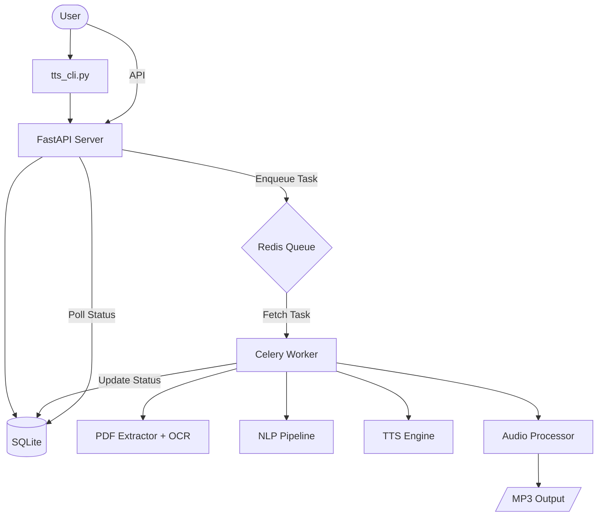

# Vietnamese PDF-to-Audio Distributed Pipeline

A robust, enterprise-grade distributed system for converting Vietnamese PDF documents into high-quality audio (MP3/WAV). Built with a microservices architecture to ensure scalability, reliability, and low latency.

---

## 🚀 Key Features

-   **Advanced Vietnamese NLP**:
    -   Intelligent text normalization and chunking.
    -   Customizable **acronym expansion** (e.g., "HĐND" → "hội đồng nhân dân").
    -   Handling of **loanwords** and specialized terminology.
-   **Robust Document Parsing**:
    -   Seamless extraction from text-based PDFs.
    -   **Concurrent OCR fallback** using Tesseract for scanned documents, optimized for multi-core CPUs.
-   **Distributed Architecture**:
    -   **FastAPI** for high-performance API communication.
    -   **Celery + Redis** for asynchronous task execution.
    -   SQLite with SQLAlchemy for persistent job tracking.
-   **Interfaces**:
    -   **CLI Tool**: Complete end-to-end pipeline in a single command.
    -   **REST API**: Fully documented with Swagger UI.
-   **Observability**:
    -   **OpenTelemetry** for end-to-end distributed tracing.
    -   **Flower** for real-time monitoring of Celery workers.

---

## 🏗️ Architecture

The system decouples the heavy AI computation from the user interface using a task queue pattern.



---

## 📂 Directory Structure

```text
📦 tts-document
 ┣ 📂 app                  # Web API Layer (FastAPI)
 ┃ ┣ 📜 main.py           # API Entrypoint & Routes
 ┃ ┣ 📜 database.py       # SQLAlchemy Configuration
 ┃ ┗ 📜 models.py         # Job tracking schema
 ┣ 📂 worker              # Background Processing Layer (Celery)
 ┃ ┣ 📜 tasks.py          # PDF Processing Orchestrator
 ┃ ┣ 📜 audio_processor.py# Audio merging & Crossfading
 ┃ ┗ 📜 nlp_pipeline.py   # Text Normalization & Chunking
 ┣ 📂 tts_engine          # Core AI Engine
 ┃ ┗ 📜 generator.py      # Vietnamese TTS Model Interface
 ┣ 📂 pdf_parser          # Document Extraction
 ┃ ┗ 📜 extractor.py      # Text Extraction & Concurrent OCR
 ┣ 📂 dictionaries        # NLP Customization
 ┃ ┣ 📜 custom_acronyms.csv
 ┃ ┗ 📜 custom_loadwords.csv
 ┣ 📜 tts_cli.py          # Unified Command Line Tool
 ┣ 📜 docker-compose.yml  # Redis & Flower Infrastructure
 ┗ 📜 requirements.txt    # Project Dependencies
```

---

## 🛠️ Getting Started

### Prerequisites

-   **Python 3.10+**
-   **Tesseract OCR**: Installed on your system and added to PATH.
-   **Docker Desktop**: For Redis and Flower.
-   **FFmpeg**: Required by `pydub` for audio processing.

### Installation

1.  **Clone the repository**:
    ```bash
    git clone <repository-url>
    cd tts-document
    ```

2.  **Set up Virtual Environment**:
    ```bash
    python -m venv venv
    .\venv\Scripts\activate  # Windows
    pip install -r requirements.txt
    ```

3.  **Start Infrastructure**:
    ```bash
    docker-compose up -d
    ```

---

## 📖 Usage Guide

### 1. Unified CLI Mode (Recommended)
The `tts_cli.py` script automates the entire process: starting services, uploading the PDF, polling for completion, and downloading the result.

```bash
# Basic usage
python tts_cli.py path/to/your/document.pdf

# Specify output location
python tts_cli.py input.pdf -o ./my_audios/output.mp3

# Skip service startup if already running
python tts_cli.py input.pdf --skip-services
```

### 2. Manual/API Mode
If you prefer to manage services manually:

-   **Start Worker**: `celery -A worker.celery_app worker --loglevel=info --pool=solo`
-   **Start API**: `uvicorn app.main:app --reload`
-   **Monitor Workers**: Visit `http://localhost:5555` (Flower)
-   **API Documentation**: Visit `http://localhost:8000/docs`

---

## 🧪 Testing & Quality Assurance

The project includes a comprehensive suite of tests:

```bash
# Run all tests
pytest tests/

# Test specific modules
pytest tests/test_nlp_pipeline.py
pytest tests/test_pdf_parser.py
```

Key test files:
-   `test_e2e.py`: Full system integration test.
-   `test_user_pdf.py`: Validates processing with real-world PDF samples.
-   `test_vietnormalizer.py`: Ensures linguistic correctness for Vietnamese text.

---

## 🛡️ Reliability & Security

-   **Resource Management**: Strict prefetch limits and timeout controls prevent OOM crashes on large documents.
-   **File Sanitization**: Automatic UUID renaming and path validation prevent injection attacks.
-   **Error Handling**: Robust retry logic and comprehensive logging (`fastapi_server.log`, `celery_worker.log`).
-   **Privacy**: Temporary files are automatically cleaned up after processing is complete.
