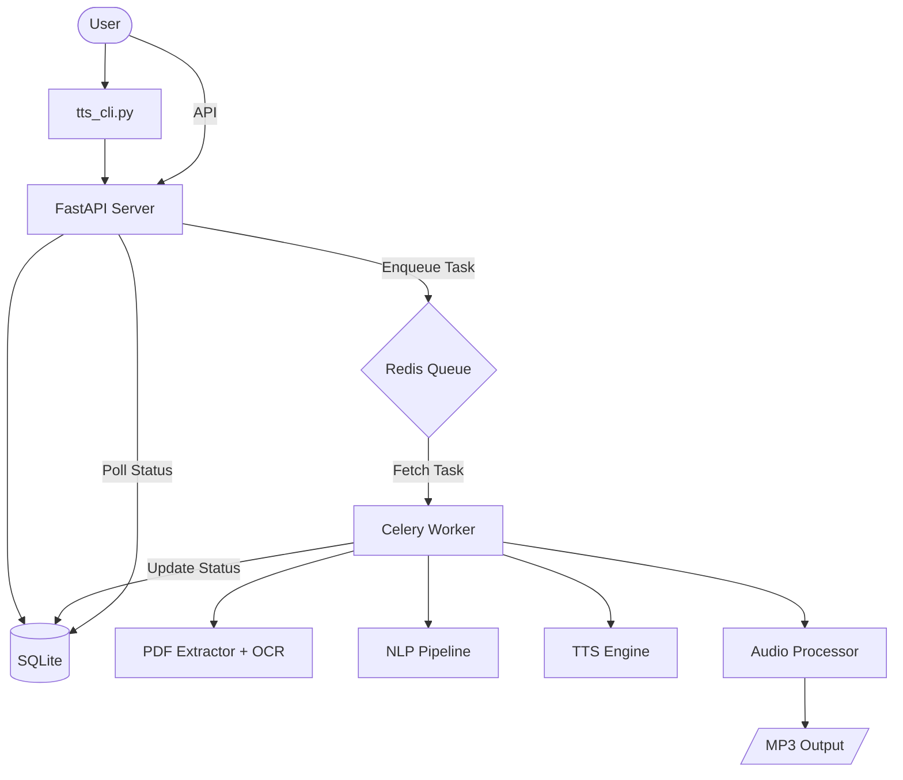

# Walkthrough: README.md Rewrite

I have rewritten the project's [README.md](file:///e:/Document/New%20folder/tts-document/README.md) to be more professional, comprehensive, and helpful for both users and developers.

## Changes Made

-   **Enhanced Title & Description**: Clearly defined the project as a "Distributed Vietnamese PDF-to-Audio Pipeline".
-   **Structured Feature List**: Highlighted key technical strengths (NLP, OCR, Scalability).
-   **Architecture Diagram**: Added a Mermaid diagram to visualize the data flow between system components.
-   **Refined Directory Structure**: Updated the directory map to reflect the actual project layout.
-   **Detailed Usage Guide**:
    *   Added a section for the **Unified CLI Mode** ([tts_cli.py](file:///e:/Document/New%20folder/tts-document/tts_cli.py)), which is the easiest way to use the project.
    *   Clarified the **API Mode** for developers using the REST interface.
-   **Technical Deep Dive**: Added sections on reliability, security, and the internal processing pipeline.
-   **Prerequisites & Installation**: Improved the setup instructions for better onboarding.

## Visual Documentation

### Architecture Diagram
The new architecture diagram illustrates how the system handles PDF uploads and processes tasks asynchronously:

## How to Verify
1.  Read the new [README.md](file:///e:/Document/New%20folder/tts-document/README.md).
2.  Check that the file links and formatting work as expected.
3.  Verify that the service startup and CLI commands match the documentation.
